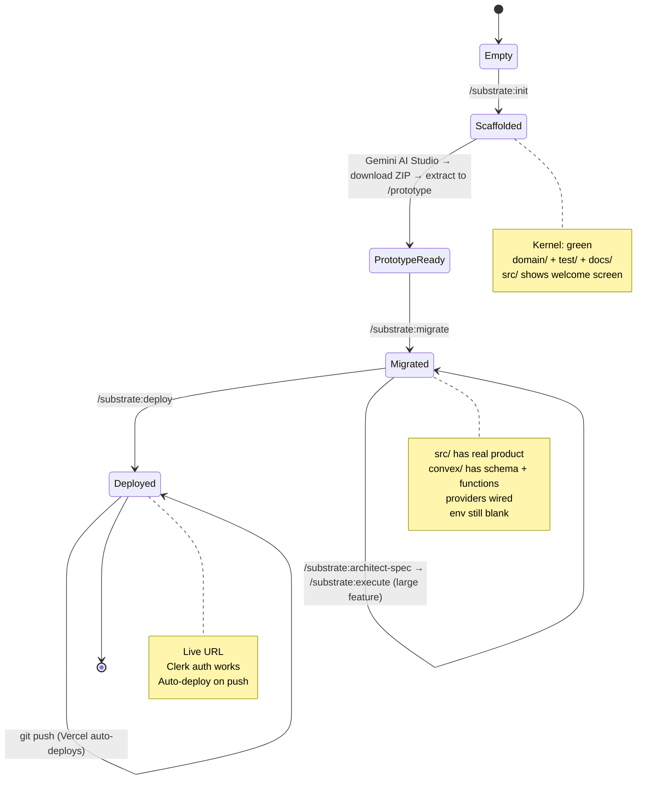
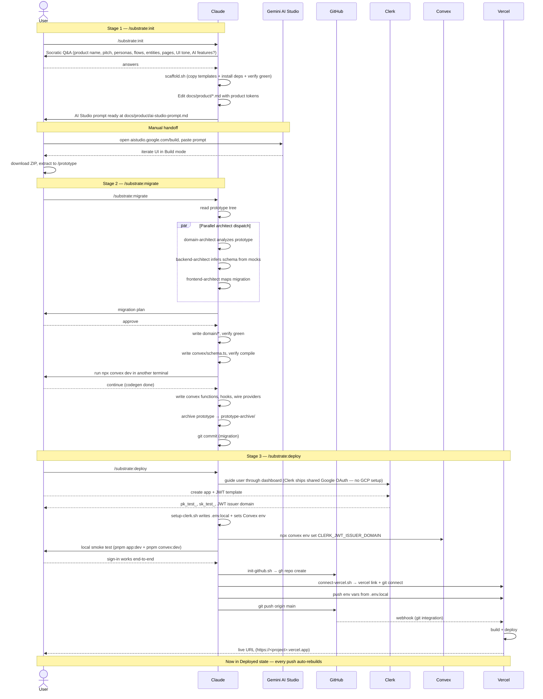
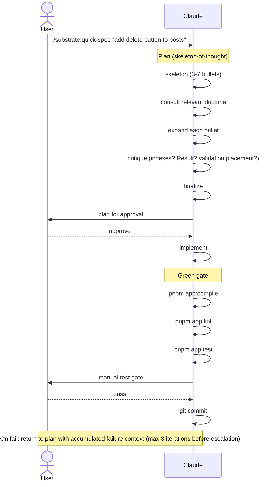
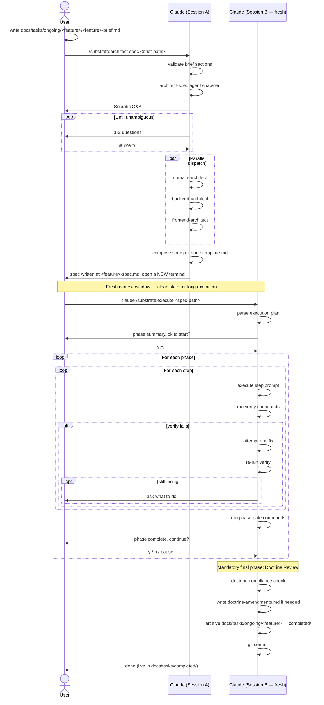

# Substrate — Pipeline Sequence Diagram

High-level view of the Substrate virtual framework, from empty folder to live deploy and beyond. Diagrams rendered via Mermaid (auto-renders on GitHub).

---

## Project states

The filesystem is the state machine. Each transition is driven by a skill.

---

## Full pipeline: empty → live

One sequence, three stages. Actors: **User**, **Claude** (running skills + subagents), **Gemini AI Studio**, **GitHub**, **Vercel**, **Clerk**, **Convex**.

---

## Feature iteration — /substrate:quick-spec

Lightweight single-feature loop. Skeleton-of-thought planning grounded in doctrine, manual test gate, commit on pass.

---

## Large feature — /substrate:architect-spec → /substrate:execute

Heavyweight gated loop. User writes a brief by hand; orchestrator runs Socratic Q&A + parallel architect analysis + spec composition. A FRESH Claude session executes the spec phase-by-phase with approval gates.

---

## Participants

| Actor | Role |
|-------|------|
| **User** | Non-technical operator. Drives skills via slash commands, answers Socratic Q&A, approves plans + phase gates. |
| **Claude** | Runs skills in a terminal session. Spawns subagents (architects) in parallel via the Agent tool. Calls bash scripts for mechanical work (scaffold, git, Vercel). |
| **Gemini AI Studio** | Browser-only UI for generating the initial frontend prototype from a scaffolding prompt. Exports a ZIP. |
| **GitHub** | Source of truth for the repo. Auto-deploy trigger for Vercel. |
| **Vercel** | Build + hosting. Auto-deploys every push to `main`. |
| **Clerk** | Auth provider. Dev instance ships with shared Google OAuth — no Google Cloud Console setup required. |
| **Convex** | Realtime database + server functions. Validates Clerk JWT via `auth.config.ts`. Generates types via `npx convex dev` / `npx convex deploy`. |

---

## Subagents (spawned by Claude, not directly addressable by the user)

| Agent | Invoked by | Role |
|-------|-----------|------|
| `domain-architect` | `architect-spec`, `/substrate:migrate` | Identifies domain concepts, enforces purity + Result pattern + Brand types. |
| `backend-architect` | `architect-spec`, `/substrate:migrate` | Schema + indexes + queries/mutations/actions, `requireAuth` placement, external API routing. |
| `frontend-architect` | `architect-spec`, `/substrate:migrate` | Route structure, hook-layer bridges, pure presentational components, Tailwind v4 styling. |
| `architect-spec` | `/substrate:architect-spec` | SDD orchestrator. Runs Q&A, dispatches the three layer architects in parallel, composes the gated spec. |
