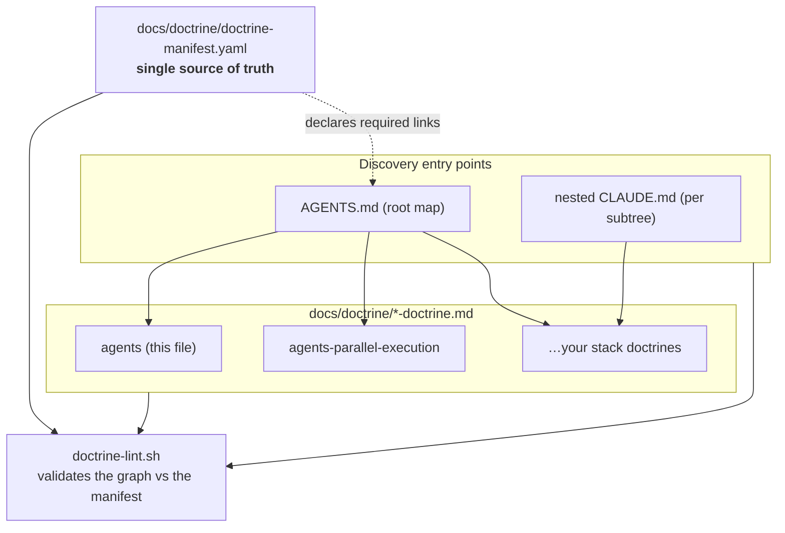
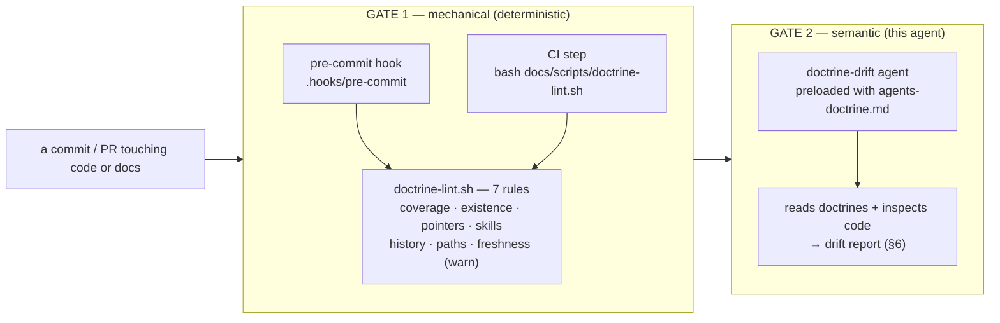
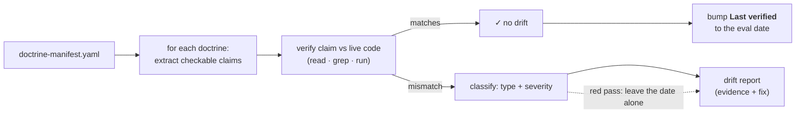

# Docs Doctrine — the doctrine on doctrines (DOCTRINE)

> **The meta-doctrine.** It governs how *all other doctrines* in this repo are written,
> linked, enforced, and kept honest. Two audiences read it:
>
> 1. **Humans / authoring agents** changing anything under `docs/doctrine/` — read §0–§4, §7–§9.
> 2. **The doctrine-drift evaluation agent** — a headless agent preloaded with this file whose job
>    is to detect **doctrine drift** (docs that no longer match the code) *early*. Its operating
>    manual is §5–§6. It reads this doctrine as context, then inspects the doctrines + the code
>    and emits a structured drift report.
>
> Self-contained. You should not need to re-derive the system from the scripts — only to edit it.

## 0. How to use this doc — the reload contract

A **living document**, like every doctrine. When you learn something non-obvious about how the
doctrine system works, breaks, or should be evaluated — **add it here**. Prefer one crisp
symptom→cause→fix line over a paragraph.

This doc is itself a doctrine, so it obeys its own rules: it is registered in
`docs/doctrine/doctrine-manifest.yaml` (id `agents`), and the mechanical linter validates it like
any other.

## 1. What a doctrine is

A **doctrine** is a single, self-contained, reloadable briefing for one domain of this repo —
the durable facts an agent needs to work in that domain without re-reading the source to orient.
Doctrines are the project's long-term memory: knowledge earned the hard way, written down once so
it survives across sessions and agents.

**The family** — the live set is always the manifest (`docs/doctrine/doctrine-manifest.yaml`),
never a hand-kept list here (see §3). The kernel ships two cross-cutting doctrines:

| Doctrine | Governs |
|---|---|
| `agents-doctrine.md` | **this file** — the system that governs all other doctrines |
| `agents-parallel-execution-doctrine.md` | running a bead DAG with parallel group-runners (one per context-budget *window*) on git worktrees |

Add your own stack/domain doctrines (`domain`, `backend`, `frontend`, `infra`, …) with
`/substrate:add-doctrine`; each registers itself in the manifest.

**Conventions (enforced):**
- One file per domain: `docs/doctrine/<id>-doctrine.md`.
- Starts with `# <Title> (DOCTRINE)` and a preload blockquote saying when to load it.
- Lives **only** in `docs/doctrine/`. Planning/spec docs live under `docs/tasks/` (see root `AGENTS.md`).

### 1.1 Root context vs doctrine — trigger vs depth

The repo carries **two** documentation layers. They are **not** redundant — they differ by
*loading mechanics*, and that difference is their whole justification:

| | `AGENTS.md` (root + nested `CLAUDE.md`) | Doctrine (`docs/doctrine/`) |
|---|---|---|
| **Loads** | **auto-injected by proximity** — the harness pulls in a directory's root/nested context (+ ancestors) when you read/edit files in that subtree | **on-demand** — only when something says "context-load this" |
| **Length** | thin (~20–40 lines) | deep (100s of lines) |
| **Role** | "you are *here*; the 2–3 local rules you can't miss; → pointer to the deep doctrine" | the durable depth |

So the root/nested context is the **trigger** tier (right context appears automatically by where
you're working); the doctrine is the **depth** tier. A doctrine can't auto-load by proximity; a
thin context file shouldn't carry depth. A nested `CLAUDE.md` at an architectural boundary is a
*good* pattern for exactly this reason.

**The ambient bridge (generated, never hand-kept):** `docs/scripts/doctrine-skills-sync.sh`
renders each manifest entry into a thin Claude Code project skill at
`.claude/skills/doctrine-<id>/SKILL.md` — description (always in context) = the manifest's
`summary` + `triggers`, body = a *pointer* to the doctrine file. That gives every doctrine a
trigger-tier presence in **any** session, orchestrated or not: an agent working in a doctrine's
scope self-loads it via ordinary skill selection. The stubs are pure derived artifacts —
regenerate them after any manifest change; never edit one by hand (the sync marker is how the
tooling tells its own stubs from yours, and Gate 1 rule 4 keeps them in lock-step with the
manifest).

**The contract (enforced by judgement in review + the Gate-2 eval, §6):**
- **Thin orientation + a pointer**, never a copy of the doctrine. The day a context file restates
  doctrine content it becomes drift bait → collapse it to a stub + link.
- **Each nested `CLAUDE.md` must say something its parent doesn't.** One that merely echoes the
  directory above is noise to be deleted ("echo-noise", §6.2).
- A subtree's context file **should point to its doctrine(s)**.

## 2. AI coding best practice — how to write & maintain a doctrine

These are the authoring rules. A good doctrine is judged against them; the drift agent (§6) uses
them as its rubric.

1. **Altitude: durable, not transient.** Capture facts that outlive a session — architecture,
   invariants, gotchas, the *why*. Never paste a task's todo list, a transient status, or
   anything the code already states plainly. If it'll be false next week, it doesn't belong.
2. **Link, don't duplicate.** One fact, one home. Cross-reference other doctrines (`[[…]]` /
   relative links) instead of copying. Duplication *is* drift waiting to happen — the copies
   diverge. (The manifest makes the canonical home explicit; see §3.)
3. **Symptom → cause → fix.** Debugging knowledge goes in a cookbook as terse triples, not prose.
4. **Self-contained + reloadable.** A reader (human or agent) should orient from the doctrine
   alone, then jump to source only to *edit*. State the durable facts inline; link for depth.
5. **Ground every claim in something checkable.** Reference real paths, real task names, real
   invariants. A claim a reader can't verify is a claim that will silently rot. This is what
   makes §6's automated drift-evaluation *possible*.
6. **Keep it current as you pass through.** If you touch code that a doctrine describes and the
   doctrine is now wrong, fix the doctrine in the *same* change. Doctrine drift is a bug.
7. **Verify before you trust (and before you recommend).** A doctrine reflects what was true when
   written. If it names a file, symbol, flag, or command, confirm it still exists before acting
   on or repeating it. Stale doctrine is worse than no doctrine — it misleads with authority.
8. **History belongs on immutable artifacts; living docs carry current state only.** Append-only
   history — a `Change Log` table, `**Version**`/`**Date**` headers — is right for an artifact
   that is *frozen once ratified*: a spec (see `_SPEC-STANDARD.md` §11). A doctrine is the
   opposite: it is edited continuously, so a hand-kept log is indexed by *date* while every agent
   queries it by *topic*, and it drifts from the file it claims to describe. Therefore:
   **git owns the history** (`git log -p docs/doctrine/<id>-doctrine.md` answers "what changed
   when", for free and without lying); the doctrine carries **current state only**; and freshness
   is attested by a single `**Last verified**: YYYY-MM-DD` header that a machine maintains
   (`/substrate:add-doctrine` writes it into the stub at authoring; a green Gate-2 pass bumps it,
   §6) rather than a version number nobody increments.
   Pre-existing history metadata is **harvested, not just deleted**: rationale-bearing rows carry
   real earned knowledge in the wrong index, so fold each row's still-true *why* inline at the
   section it cites, then remove the table/header and paste it verbatim into the removal commit
   body. Mechanically enforced — Gate 1 rule 5 (§5) fails a registered doctrine that carries
   either marker.

### 2.1 The Binding Rules section is the doctrine's digest

A skill is affordable because it is split in two: a one-line `description` that is *always* in
context, and a body that loads only when it's actually needed. **Doctrine gets the same split, and
`## 2. Binding Rules` is the description tier.** Inlining a 2,000-line doctrine into every
dispatch prompt is the changelog problem inverted — paying full price for context nobody reads;
telling a worker "go read the doctrine" costs nothing and *verifies* nothing. The digest is the
middle tier: **push** the Binding Rules at dispatch (cheap, and it provably arrived), **pull** the
full body only when a bead sits squarely inside the doctrine's `paths` (§3.1).

The extractor is `docs/scripts/doctrine-digest.sh <id>`: it resolves the id through the manifest
and prints that doctrine's binding-rules block, from its heading to the next `## `. It finds the
section by **name first, position second** —

1. a heading naming the binding tier (`## … Binding Rules …`, `## … Policies …`), numbered or not
   — the shape `/substrate:add-doctrine` scaffolds;
2. otherwise the numbered `## 2. …` slot, whatever its title.

so the kernel's two doctrines both digest as-is without a heading rename that would orphan every
`§Policy-N` cross-reference: this file resolves by position (§2, the authoring rules), and
`agents-parallel-execution-doctrine.md` by name (`## Policies`). A doctrine that satisfies
*neither* has no digest, and `doctrine-digest.sh` says so rather than printing something wrong.

**What this asks of you as an author:** the Binding Rules section must stand alone. It is what a
worker with no other context will act on, so it carries MUSTs and MUST NOTs, not narrative, and no
"as described above" that dissolves when the section is lifted out. Everything else — rationale,
cookbook, mermaid — stays in the body where the full read finds it.

## 3. The manifest — single source of truth

`docs/doctrine/doctrine-manifest.yaml` is the **registry**: every doctrine, plus the docs that
must link to it. Nothing about the doctrine *set* is implicit — the manifest is the law, the
linter enforces it.

```yaml
doctrines:
  - id: agents                                     # file MUST be docs/doctrine/<id>-doctrine.md
    path: docs/doctrine/agents-doctrine.md          # must exist
    pointers: [AGENTS.md]                            # docs that MUST contain a link to this doctrine
    summary: The doctrine on doctrines — …           # one-line "why read this"
    triggers: [doctrine, manifest, drift]            # brief-content keywords (optional)
    paths: [docs/doctrine/**, docs/scripts/doctrine-lint.sh]   # governed files (optional)
    layer-hint: cross-cutting                        # optional
```

**Why a manifest at all:** it turns "is every doctrine discoverable and correctly cross-linked?"
from a question nobody answers into a machine-checkable invariant. Add a doctrine → register it
here (and create at least one pointer). Rename/move one → update here + its pointers. The linter
fails the build otherwise. **The manifest is also the entry point the drift agent enumerates** (§6).

### 3.1 `triggers` vs `paths` — two different keys, two different questions

They look alike and are not interchangeable:

| key | matches | answers | consumed at |
|---|---|---|---|
| `triggers` | a **brief** (prose keywords) | "is this doctrine relevant to what the human asked for?" | spec time — which `doctrine-architect`s to dispatch; and as the *unlabelled-bead* fallback (below) |
| `paths` | a bead's **write-scope** (file globs) | "does this doctrine *govern the files this work will edit*?" | graph time — which `doctrine:<id>` labels a bead carries |

`paths` is optional and lists globs of the files the doctrine governs, relative to the repo root.
It exists because prose matching cannot answer the file question: a bead whose write-scope is
`convex/**` is bound by the backend doctrine whether or not its one-line goal happens to contain
the word "backend". Declaring `paths` is what lets binding move from **pull** (the worker is told
to go read something, unverifiably) to **push** (the dispatcher inlines the right doctrine's
Binding-Rules digest into the worker's prompt — see the digest convention in §2.1).

`triggers` keeps one job past spec time: it is the **fallback** a pull-side consumer uses on a bead
that carries *no* `doctrine:<id>` label — beads graphed before label-stamping existed, and repos
whose manifest declares no `paths:` at all. A labelled bead is resolved by its labels only;
widening past them re-imports the guesswork the labels replaced.

**Write `paths` as an inline list — `paths: [a/**, b/c.sh]`, on one line.** The manifest is read by
a tiny zero-dep line parser that reuses the `pointers` bracket form, so a YAML block sequence
(`paths:` then `- a/**`) parses as *nothing*: Gate 1 rule 6 goes silent and the graph-time binding
step stamps no label, both reporting success. Same trap as an aspirational glob, one level lower.

Rules: omit the key entirely when a doctrine has no stable file footprint — an absent `paths` is
honest, an aspirational one is a lie the tooling will act on. Every declared glob must match at
least one existing file (Gate 1 rule 6): a glob that has rotted past a rename silently governs
nothing, which is worse than no glob at all, because the binding step reports success. Keep globs
broad enough to survive ordinary refactors (`convex/**`, not a file list).

## 4. Cross-linking model + architecture

Doctrines form a small graph: the **root map** (`AGENTS.md`) and each subtree's `CLAUDE.md` point
*into* the doctrines; doctrines point *sideways* to siblings. The manifest declares which of those
links are **required** (the `pointers` of each entry), so a rename can't silently orphan a doc.



## 5. Enforcement gates

Two tiers. The **mechanical** gate is cheap, deterministic, and runs on every commit/push. The
**semantic** gate (the drift agent, §6) is deeper, judgement-based, and catches what grep can't.



**Gate 1 — mechanical (`docs/scripts/doctrine-lint.sh`, pure bash, zero deps).** Seven rules, in
the order the script implements them (its header block enumerates the same seven). This numbering
is the one the rest of this doctrine cites as "Gate 1 rule N":

1. **Coverage** — every `docs/doctrine/*-doctrine.md` is registered in the manifest.
2. **Existence** — every entry's `path` exists and matches `docs/doctrine/<id>-doctrine.md`.
3. **Pointers** — every `pointers[]` file exists *and links to* the doctrine (the rename-rot guard).
4. **Skills** — *if* managed ambient stubs exist under `.claude/skills/doctrine-*/` (§1.1's
   bridge, written by `doctrine-skills-sync.sh`), they mirror the manifest 1:1 and reference the
   right doctrine file. Zero managed stubs → the rule is silent, so repos that haven't adopted
   the bridge stay green.
5. **History** — no `Change Log` heading and no `**Version**` header in a *registered* doctrine
   (§2 rule 8). The failure names the remedy: harvest-then-delete.
6. **Paths** — every glob in an entry's optional `paths:` matches ≥1 existing file (§3.1). No
   `paths` key → the rule is silent. Matching is bash-3.2 safe and deliberately permissive (a
   `*` may cross `/`): the question is "does this still govern *something*", not "exactly what".
7. **Freshness (advisory — warns, never fails)** — a registered doctrine whose `**Last verified**`
   is absent, unparseable, or older than 6 months prints a warning; the exit code stays 0. It has
   to be advisory: "is this still true?" is Gate 2's judgement call (§6), and a hook that blocked
   the commit would only teach people to `--no-verify` or to bump the date without looking, which
   is the failure mode the header exists to prevent. Date parsing probes BSD `date -j -f` then
   GNU `date -d` — the two are mutually unintelligible and a hook runs on whatever the dev has.
   **An absent header is the correct state for a doctrine no Gate-2 pass has ever cleared** — the
   two kernel doctrines ship that way and warn on a fresh clone. The warning is a *scheduling*
   signal, not a defect to silence: the only legitimate writers of the field are
   `/substrate:add-doctrine`'s stub at authoring, `/substrate:adopt`'s harvest when it strips a
   pre-existing `**Version**`/`Change Log` (Step 7.5), and a green Gate-2 pass (§6.1 step 6).
   Hand-stamping a date to clear the warning re-creates the self-reported version number §2 rule 8
   exists to abolish.

- **Scope is one level deep, and that is load-bearing.** Coverage globs
  `docs/doctrine/*-doctrine.md` — non-recursive — and every other rule scopes either to the
  manifest's own entries or (rule 4) to the generated stubs. That is precisely what makes
  retirement work: moving a doctrine into `docs/doctrine/archive/` (plus dropping its manifest
  entry) is how it stops being governed. Make any rule recursive and archived doctrines get
  linted again, breaking `--retire`.
- Runs via `bash docs/scripts/doctrine-lint.sh`, called by **both** `.hooks/pre-commit` (local,
  installed by `git config core.hooksPath .hooks`; bypassable with `--no-verify`) **and**
  `.github/workflows/doctrine-lint.yml` (the unbypassable gate).
- **Limits:** it checks *structure* (links resolve, files registered). It cannot tell whether a
  doctrine's *content* is still true. That's Gate 2's job.

**Gate 2 — semantic (the doctrine-drift evaluation agent):** §6.

## 6. The doctrine-drift evaluation protocol (drift agent operating manual)

> You are the doctrine-evaluation agent. You have this file as context. Your mission: **find
> doctrine drift early** — places where a doctrine asserts something the code no longer supports —
> and report it with evidence and a fix, before it misleads the next agent.

### 6.1 Method (per doctrine in the manifest)

1. **Enumerate.** Read `docs/doctrine/doctrine-manifest.yaml`; for each entry, open its `path`.
   Then also enumerate every **`**/CLAUDE.md`** / root `AGENTS.md` — they carry the same kind of
   checkable claims (§1.1) and drift the same way, so they are **in scope** for this eval and its
   report. Skip vendored trees (`node_modules/`, `.venv/`).
2. **Extract checkable claims.** Pull out every assertion a reader could verify against the repo:
   - **Paths/symbols** — anything in backticks that looks like a file, dir, function, route, flag,
     env var, or task name.
   - **Invariants** — sentences with *never / always / must / only / the one rule* (e.g.
     "the frontend never imports backend code", "register `/api` before the SPA fallback").
   - **Commands/tasks** — `make …`, `npm …`, shell snippets.
   - **Status claims** — *shipped / live / pending / reserved / TODO* + any dates/versions.
   - **Interface/shape** — documented signatures, schemas, routes, counts ("11 routes",
     "7 invariants"), mermaid node labels naming real code.
3. **Verify each claim against the live repo.** Use the read/search/run tools: does the path
   exist? does the symbol still have that name/shape? does the command/task exist and (where safe)
   succeed? does the invariant still hold (grep for the forbidden import, the mount order, etc.)?
   does the status match git/code reality?
4. **Classify any mismatch** by the drift taxonomy (§6.2) and **severity** (§6.3).
5. **Emit the report** (§6.4) — evidence + a concrete fix per finding. Do **not** edit doctrines
   yourself unless explicitly asked; your output is the finding.
6. **Bump `Last verified` — but only on a green pass.** A doctrine you evaluated end-to-end with
   **zero findings** gets its `**Last verified**: YYYY-MM-DD` header set to today's eval date (add
   the header if the file has none — that's its first attestation). A doctrine with **any** finding
   is left **untouched**: the header means "checked, and still true", so bumping it on a red pass
   would launder a known-drifted doctrine as fresh — worse than no date at all. Same for a doctrine
   you only partially evaluated: no full pass, no bump.
   This is the **one** doctrine edit the drift agent makes unasked, and it is what makes the field
   different from a hand-kept version number: a *machine* maintains it, as a side effect of an
   actual verification, so it cannot drift from the thing it attests. Gate 1 rule 7 (§5) warns when
   it goes stale past 6 months, which is the signal to schedule the next pass.



### 6.2 Drift taxonomy

| Type | The doctrine says… but the code… | Typical signal |
|---|---|---|
| **Path drift** | references a file/dir/symbol | …moved, was renamed, or deleted | backtick path 404s; symbol not found |
| **Invariant drift** | states a never/always/must rule | …now violates it | grep finds the forbidden thing |
| **Interface drift** | documents a signature/route/schema/count | …has a different shape | signature/route mismatch |
| **Command drift** | gives a command/task | …renamed or removed it | script/task missing |
| **Status drift** | says shipped/pending/reserved + dates | …is in a different state | git history / code contradicts |
| **Duplication drift** | states a fact also stated elsewhere | …the two copies disagree | two docs, divergent values |
| **Coverage drift** | (omission) | …a subsystem/area has no doctrine, or a doctrine section is now empty/missing | new top-level dir, undocumented module |
| **Echo-noise** (`CLAUDE.md`) | a nested `CLAUDE.md` repeats its parent / the doctrine | …adds nothing the parent or doctrine doesn't | a nested file whose every claim is already stated above it → flag for prune (§1.1) |

### 6.3 Severity

- **Critical** — would mislead an agent into *breaking* code: invariant or interface drift, a
  wrong "the one rule", a mount-order/contract claim that's now false.
- **Major** — costs real time but won't corrupt code: path/command drift, a dead documented task.
- **Minor** — cosmetic/stale: status words, dates, counts slightly off, prose nits.

### 6.4 Report format (machine-readable, one row per finding)

```
doctrine | section | claim (quoted) | drift_type | severity | evidence (file:line / cmd output) | recommended_fix
```
Lead with a one-line verdict (`N findings: C critical, M major, m minor`), then the table, then a
**completeness note**: which doctrines you fully evaluated, and any claim you *couldn't* verify
(so a human knows the coverage of the pass). Silence is not proof of health — say what you checked.

Close with a **freshness ledger** — one line per doctrine in the manifest:

```
doctrine | pass (green / findings / partial) | Last verified: <bumped to YYYY-MM-DD | unchanged, was YYYY-MM-DD | unchanged, absent>
```

It is the audit trail for the one mutation you are allowed to make (§6.1 step 6): every bump is
justified by a green row, and every un-bumped doctrine says why. A reader must be able to check
your date edits against your findings without re-running the pass.

### 6.5 Tuning the pass
- **Scope to the diff when CI passes a changed-file set** — evaluate doctrines whose domain the PR
  touched first (a backend change → re-check the backend doctrine), then sweep the rest if budget
  allows. Drift is introduced by code changes; follow the change.
- **Prefer false positives you can dismiss over missed Critical drift.** When unsure whether an
  invariant still holds, flag it with your uncertainty rather than assume.
- **Cite, don't assert.** Every finding carries `file:line` or command output. A finding without
  evidence is itself noise.

## 7. Invariants

1. **Every doctrine is registered in the manifest.** No orphans. (Gate 1: coverage.)
2. **The manifest is the only source of truth for the doctrine set + required links.** Don't
   hand-maintain a parallel list anywhere; link to the manifest.
3. **One fact, one home.** Cross-link instead of duplicating; duplication is latent drift.
4. **Doctrine changes ship with the code change that made them true/false.** Drift is a bug, fixed
   at the source, not deferred.
5. **Naming + location are fixed:** `docs/doctrine/<id>-doctrine.md`; nowhere else.
6. **Mechanical gate stays cheap & deterministic; semantic gate stays evidence-based.** Don't push
   judgement work into the linter, or grep work onto the agent.

## 8. Anti-patterns

- **A doctrine that restates the code.** If it's derivable by reading one file, it's not doctrine —
  it's a stale copy. Capture the *why* and the *non-obvious*, not the obvious.
- **Status/TODOs in a doctrine.** Those belong in `docs/tasks/` + tbd beads; they rot fastest.
- **Copy-paste across doctrines.** Two homes for one fact → guaranteed divergence. Link.
- **Adding a doctrine without a manifest entry / pointer.** Gate 1 blocks it; don't `--no-verify`.
- **"Fixing" drift by deleting the inconvenient claim.** If a claim is false, verify reality and
  correct it; don't quietly drop the invariant the claim was protecting.
- **Changelog / version headers in a doctrine.** Git is the history, and a hand-kept log files
  by date what agents query by topic (§2 rule 8). Gate 1 rule 5 fails it. The fix is
  **harvest-then-delete** — fold each row's still-true rationale in as a why-note at the section
  it cites, then remove the table/header (verbatim into the removal commit body). Never a bare
  delete: the rows are earned knowledge in the wrong index, not noise.

## 9. Cookbook — authoring & maintenance

**Add a doctrine.** Create `docs/doctrine/<id>-doctrine.md` (title + preload blockquote) → add a
`doctrine-manifest.yaml` entry (`id`, `path`, `pointers`, `summary`) → add the actual link in each
pointer doc (root `AGENTS.md` and/or the subtree `CLAUDE.md`) → `bash docs/scripts/doctrine-lint.sh`
until green → commit (the hook re-checks). `/substrate:add-doctrine` automates the stub + entry.

**Rename/move a doctrine.** `git mv` the file → update its H1 → update the manifest `path` (and the
`id` if the slug changed) → update every pointer's link → grep the repo for the old name → lint →
commit. (This is exactly the rename that motivated Gate 1.)

**Retire a doctrine.** `/substrate:add-doctrine --retire <id>` automates it: drop the manifest
entry, move the file to `docs/doctrine/archive/` (that move is the de-registration — coverage is
non-recursive, §5), fold still-true rules into the surviving doctrines, remove inbound pointers,
re-run `docs/scripts/doctrine-skills-sync.sh` to sweep the ambient stub, then lint. Doing it by
hand: the same steps, in that order; grep for dangling references before you lint.

**Evaluate for drift (manual or the drift agent).** Follow §6. Quick local smoke:
`bash docs/scripts/doctrine-lint.sh` for structure, then spot-check a doctrine's backticked paths exist.

**Prune CLAUDE.md echo-noise (periodic).** Part of the Gate-2 pass (§6.1 enumerates `**/CLAUDE.md`):
for each nested `CLAUDE.md`, confirm it states something its parent / the doctrine doesn't (§1.1).
A file that only echoes its parent is flagged as echo-noise (§6.2) → collapse to a stub + pointer,
or delete. Keeps the auto-loaded trigger layer thin and worth the context budget.

## 10. Pointers
- `docs/doctrine/doctrine-manifest.yaml` — the registry this doctrine governs.
- `docs/scripts/doctrine-lint.sh` — the mechanical Gate 1 implementation.
- `docs/scripts/doctrine-digest.sh` — prints a doctrine's Binding Rules digest (§2.1).
- `.hooks/pre-commit`, `.github/workflows/doctrine-lint.yml` — where the gate is wired.
- `AGENTS.md` — the root map; the spec/task lifecycle (`docs/tasks/`) that doctrines must *not* absorb.
- `agents-parallel-execution-doctrine.md` — the parallel orchestration policy: the group-runner (window) role and the context-budget partition.
